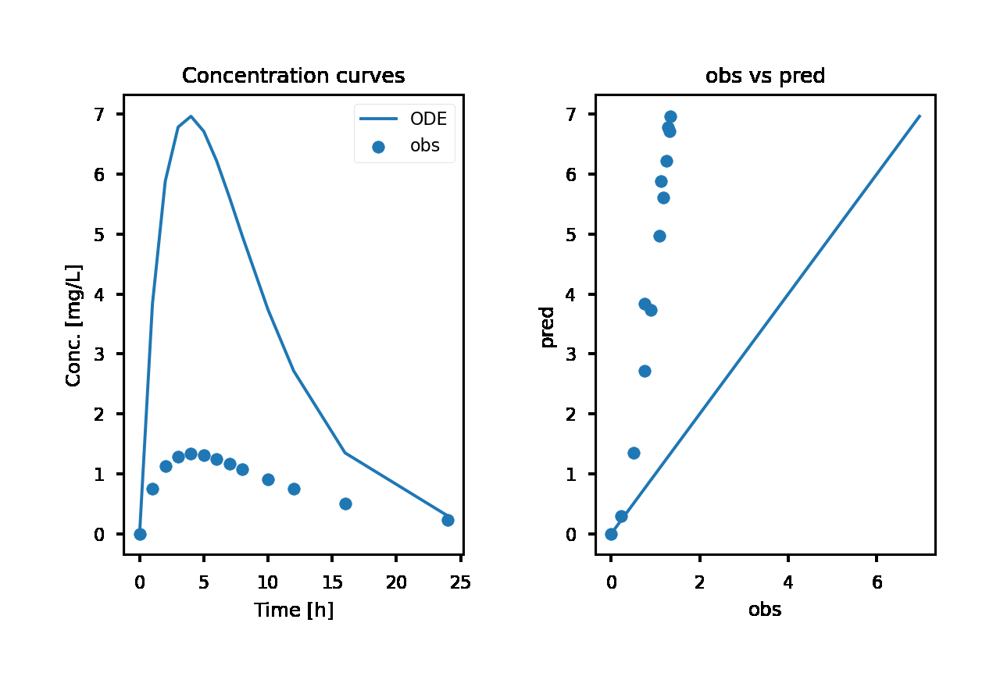

# TensorFlow for Solving Pharmacokinetic Equations

Code for solving initial value problems / ODEs in TF/keras. Can be used directly for deployment ODE systems to production on web or mobile platforms. Currently only the unoptimized code w/o the keras model wrappers.

## Contents
* `TF_PK_odesolve_OA.ipynb`: isolated ODE solve and simple fit of single dose 1 CMT oral absorption

* (`keras_nODE_1CMT_OA.ipynb`)

## Requires

* TF 2.4 or higher
* [tfdiffeq](https://github.com/titu1994/tfdiffeq)
